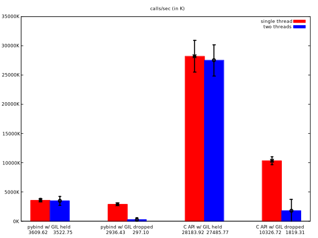

toy example for GIL contention test.

`test_abc()` measures calls/sec

a) single threaded:
```
for _ in range(10000000):
  test_abc()
```

b) Case b): multi threaded, two threads, each doing a), but
 `test_abc()` drops the GIL

```
python setup.py develop
python -u main.py | tee data.dat
```

Results on MacBook (in 1000 calls/sec):

```
method	single thread	two threads
pybind w/ GIL held	5769.2	5542.3
pybind w/ GIL dropped	4360.5	1614.7
C API w/ GIL held	77954.0	76413.6
C API w/ GIL dropped	15467.2	5259.7
C++ loop	3584229.4	7043703.5
```



(C++ results not shown as they require a [log plot](plot-log.svg).)
