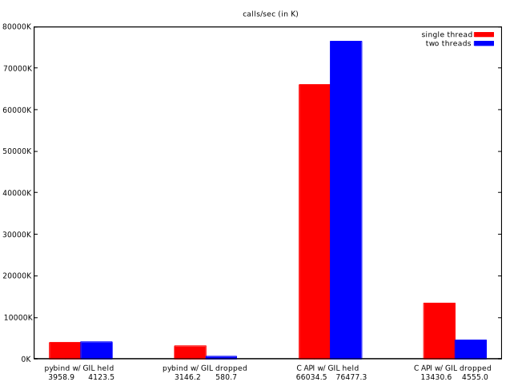

toy example for GIL contention test.

`test_abc()` measures calls/sec

a) single threaded:
```
for _ in range(10000000):
  test_abc()
```

b) Case b): multi threaded, two threads, each doing a), but
 `test_abc()` drops the GIL

```
python setup.py develop
python -u main.py | tee data.dat
```

Results on MacBook (in 1000 calls/sec):

```
method	single thread	two threads
pybind w/ GIL held	4261.2	3978.7
pybind w/ GIL dropped	3252.8	555.7
C API w/ GIL held	64272.7	75916.3
C API w/ GIL dropped	13102.4	4029.2
C++ loop	3584229.4	7043703.5
```



(C++ results not shown as they require a log plot.)
